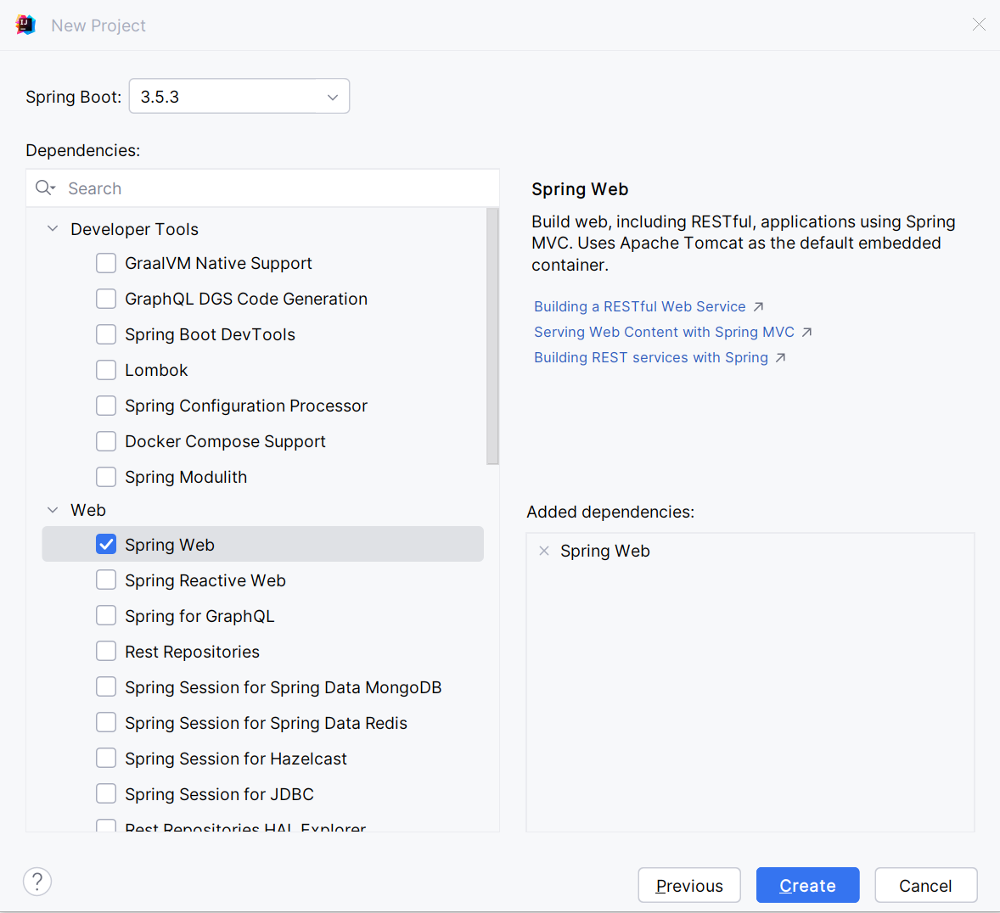
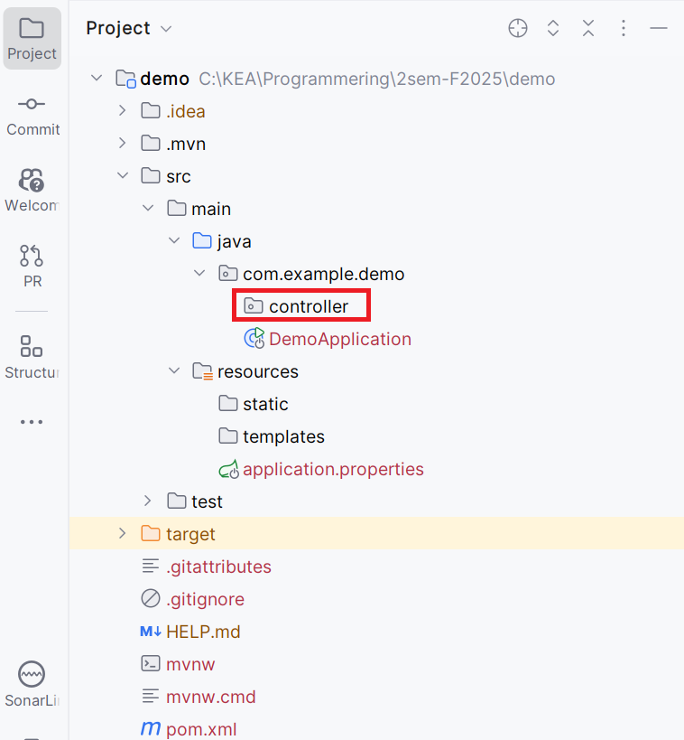

## Beskrivelse
### Introduktion til  2. semester.
Vi går fra tekstbaserede standalone applikationer til webapplikationer
Vi går fra tekstfiler til databaser
Vi benytter stadig Scrum som udviklingsproces
Vi stræber stadig efter godt programdesign og høj kundeværdi
Vi vil optimere og automatisere vores udviklingsproces ud fra CI/CD principperne (Continuous Integration og Continuous Delivery)

### Nye teknologier
Vi tegner i dag sammen det “store billede” over de komponenter og teknologier, som I kommer til at arbejde med i løbet af semestret:

 - Browser (HTML, CSS) Netværksprotokol (HTTP) Servere (Tomcat og MySQL)
  - Spring Boot Web MVC Framework (Java web applikationer)
  -  Database med JDBC og SQL 
- Github Actions (automatisering af CI/CD workflow)
- Azure (deployment af webapplikation og database i skyen)

### Semestret – praktisk info
Vi går igennem semesterplanen, de obligatoriske opgaver, kravene til eksamen og hvad I ellers måtte have af spørgsmål til 2. semester.

### End points
Vi ser på hvad et endpoint er og laver vores først endpoints i Spring Boot

## Forberedelse
client-server begrebet [Client-server model](https://en.wikipedia.org/wiki/Client–server_model) (10  minutter)    

Se disse videoer:  
[HTTP Essential Training](https://www.linkedin.com/learning/http-essential-training/what-is-http?resume=false&u=36836804)  
[Spring Boot REST API - Getting Started | Chapter-1 ](https://www.youtube.com/watch?v=A86pk2n-u9I&list=PLpxcSt9FGVVGRjn_Hgrxl6WJv4aFUDjKE&index=1)  
[Mastering @RequestMapping Annotation in Spring Boot | Chapter-2](https://www.youtube.com/watch?v=OhRstcHvIM4&list=PLpxcSt9FGVVGRjn_Hgrxl6WJv4aFUDjKE&index=2)  
[Mastering @RequestParam Annotation: A Step-by-Step Guide | Chapter-3](https://www.youtube.com/watch?v=TJG-LTLZo5s&list=PLpxcSt9FGVVGRjn_Hgrxl6WJv4aFUDjKE&index=3)  
[@PathVariable Annotation: Everything You Need to Know | Chapter-4](https://www.youtube.com/watch?v=BVRRfmBHKSU&list=PLpxcSt9FGVVGRjn_Hgrxl6WJv4aFUDjKE&index=4)


## Læringsmål
- Forstå HTTP protokollens virkemåde
  - request og response message
  - GET og POST kommandoer
  - statuskoder
- Forstå opbygningen af en URL inkl.
  - request parametre,
  - path variable, 
- Lav dit første get-endpoint i Spring Boot, herunder brug af annoteringerne:  
  - `@Controller` (`@RestController`)
  - `@RequestParam`
  - `@PathVariable`
--- 

## Indhold
### Didaktisk tilgang
- Vi underviser projektbaseret, dvs det er projekerne der er det styrende element
- Der er ikke "silo undervisng" i Programmering, Systemudvikling og Teknologi
- De emner der undervises i er bestemt ud fra hvad der er behehov for i det projekt der arbejdes på. Nye emner bringers derfor "i context" med det samme
- Alle emner i Porgrammering, Systemudvikling og Teknologi dækkes, men intensiteten af undervisningen i de enkelte fagområder varierer fra uge til uge


### Semestrets projekter
Semestret iudeholder tre "full-stack" projekter, som vist i nedenstående tabel:
| Projekt | Bemærkninger                        |
|--------------------|------------------------------|
| Turistguide        | Består af tre delprojekter der er "stilladserede", dvs det samlede projekte er opdelt i små delprojekte, hvor hvert enkelt delprojekt på forhånd er struktureret således at det understøtter bestemte læringsmål   |
| Miniprojekt           | Scrum projekt med ét sprint              |
| Eksamensprojekt    | Scrum projekt med tre sprints     |

### Dit første Spring Boot projekt
- Åben IntelliJ
- Gå til File | New | Project...
- Udfyld dialogbokse




Opret en pakke `controller`



Opret en klasse `WelcomeController` i `controller`pakken
```java
package com.example.demo.controller;

import org.springframework.web.bind.annotation.GetMapping;
import org.springframework.web.bind.annotation.RestController;

@RestController
public class WelcomeController {
    @GetMapping("welcome")
    public String welcome() {
        return "Velkommen til 2. semester";
    }
}
```
Afprøv allpikationen. Hvilken URl skal endponitet tilgås på?

Prøv herefter at tilføje en `@RequestMapping("ea")`. Hvilken URL skal endpointet nu tilgås på?

---

## RestController vs Controller
Når man bruger @RestController, bliver objekter automatisk konverteret til [JSON](https://en.wikipedia.org/wiki/JSON) og returneret i HTTP-responsen.
Men når man bruger @Controller (som man normalt gør ved server-side rendering med Thymeleaf), forventer Spring, at man returnerer en String, som henviser til et view (f.eks. en .html-skabelon). Hvis man i stedet prøver at returnere data som objekter direkte, vil Spring forsøge at lede efter en Thymeleaf-side med det navn – og fejle.

### Løsningen: ResponseEntity
Ved at bruge ```ResponseEntity<>(dataObjekt, HttpStatus.STATUSKODE);``` kan man stadig returnere data fra en @Controller, men også http statuskoden.

### Eksempel med brug af @Controller
```java
@Controller
public class WelcomeController {
    @GetMapping("welcome")
    public ResponseEntity<String> welcome() {
        return new ResponseEntity<>("Velkommen til 2. semester", HttpStatus.OK);
    }
}
```

---
##  Struktur i en Spring Boot applikation
```text
src
 └── main
     └── java
         └── com.example.demo
             ├── controller
             ├── service
             ├── repository
             └── model
```

- `controller` håndterer HTTP-forespørgsler
- `service` indeholder forretningslogik
- `repository` håndterer dataadgang
- `model` indeholder klasser der beskriver applikationes data, dvs de data der flyder imellem client og server

Det er vigtigt at alle pakker ligger under projektetes rod pakke, her: com.example.demo


