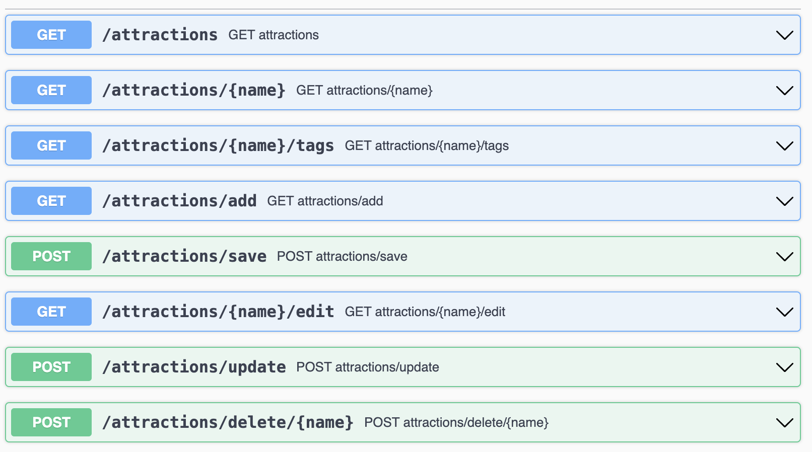

## Turistguide Controller Testing (Weblag)

Formålet med opgaven er at teste implementeringen af controlleren i Turistguide-projektet (del 2). 
Controlleren skal testes isoleret i web-laget med en slice test, hvor HTTP-forespørgsler simuleres, og servicelaget mockes.

Der skal testes mindst en GET og POST endpoint i Turistguide applikationen:

### GET-request

Skriv en test, der verificerer følgende for et GET-endpoint:
1. At HTTP-forespørgslen returnerer den forventede statuskode. 
2. At den forventede view-navn returneres. 
3. At de forventede modelattributter er til stede. 
4. At den forventede service-metode er blevet kaldt med de rigtige parametre.

### POST-request

Skriv en test, der verificerer følgende for et POST-endpoint:
1. At HTTP-forespørgslen returnerer den forventede statuskode. 
2. At det forventede view-navn returneres (f.eks. med "redirect:"). 
3. At de forventede modelattributter er til stede. 
4. At den forventede service-metode bliver kaldt én gang med det CoffeeOrder-objekt, der indeholder de rigtige værdier.
