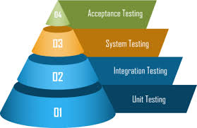
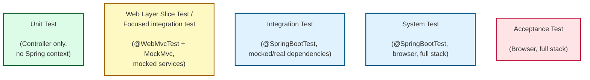
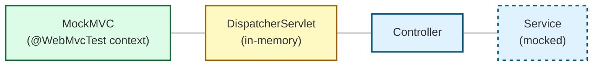

# MockMVC, Mockito og test af Controller

## Beskrivelse
Vi skal se på forskellige slags test, og specifikt på test af controlleren.
## Forberedelse
Læs: [Software Quality: understanding the different types of software testing](https://www.tuleap.org/software-quality-different-types-software-testing)

Se videoer:

---
## Læringsmål
- At kunne forklare de forskellige testniveauer
- At kunne forklare mocking
- At kunne anvende MockMVC testværktøj
- At kunne anvende Mockito framework
- At kunne skrive tests af Controller klasser

---
## Indhold
- Testniveauer
- MockMVC, @WebMVCTest
- Mockito
- Test af controllere
- Web layer slice / "Focused" integration test af controller
---
### Testniveauer

©️tuleap.org


---
### System Oversigt

```mermaid
flowchart LR
    %% ==== Styles ====
    classDef client fill:#ffffff,stroke:#111111,stroke-width:2px
    classDef server fill:#e8c159,stroke:#a97f2f,stroke-width:2px
    classDef infra fill:#fef9c3,stroke:#a16207,stroke-width:2px
    classDef app fill:#e0f2fe,stroke:#075985,stroke-width:2px
    classDef db fill:#ffffff,stroke:#111111,stroke-width:2px

    %% ==== Nodes ====
    HTTPCLIENT["HTTP Client<br/>(Browser)"]:::client
    WEBSERVER["Web Server<br/>(Tomcat)"]:::server
    DISPATCHERSERVLET["DispatcherServlet"]:::infra
    CONTROLLER["Controller"]:::app
    SERVICE["Service"]:::app
    REPOSITORY["Repository"]:::app
    DB["Database<br/>(MySQL)"]:::db

    %% ==== Connections ====
    HTTPCLIENT --- WEBSERVER
    WEBSERVER --- DISPATCHERSERVLET
    DISPATCHERSERVLET --- CONTROLLER --- SERVICE --- REPOSITORY --- DB
```


---
### Test af Controller
- Der er forskellige niveauer af test, der kan udføres på en controller i en Spring Boot-applikation.

- Unit test verificerer en enkelt klasse eller metode i isolation, typisk med alle afhængigheder mocket. 
- Web layer slice test verificerer en controller ved at starte en minimal Spring-kontekst med @WebMvcTest og mocke de underliggende servicelag. 
- Integrationstest verificerer samspillet mellem flere lag eller komponenter. 
- Systemtest verificerer hele systemet som en samlet applikation i et realistisk miljø, typisk med alle lag og eksterne integrationer uden mocks. 
- Acceptance / End-to-end test verificerer hele applikationen fra klient til database i et miljø, der simulerer den virkelige driftssituation.

---

### Web slice test (focused integration test) af Controller
- For at kunne teste en controller isoleret (web layer slice test) skal der mockes/simuleres http forespørelser og andre dependencies dvs. service laget
  

---
### Mocking

- Mocking er at erstatte en afhængighed med et simuleret objekt, som returnerer kontrollerede værdier i en test sammenhæng
- Mocking gør det muligt at isolere den kode, som skal testes, og simulere dens omgivelser på en kontrolleret måde
- En mock kan returnere værdier og verificere, at bestemte kald er sket
---
### MockMVC

- MockMVC er en klasse i Spring test framework, der bruges til at teste web-laget (controller-laget) i en Spring Boot-applikation.
- Med MockMVC kan man simulere HTTP-forespørgsler til Spring MVC-controllere og verificere, hvordan controlleren håndterer dem.
- MockMVC skaber simulerede HTTP-forespørgsler uden at starte en rigtig webserver.

Simulere HTTP GET forespørgsel
```java
 mockMvc.perform(get("/hello"));
```

Simulere HTTP GET forespørgsel og teste responsen
```java
 mockMvc.perform(get("/hello"))
                .andExpect(status().isOk())
                .andExpect(view().name("hello-world"));
```
---
### @WebMVCTest

- @WebMvcTest er en Spring Boot test-annotation, der bruges til at teste web-laget (controllerer)
- @WebMvcTest bruges ofte med MockMVC for at simulere HTTP-anmodninger uden at starte en rigtig server
- Loader kun web-laget (f.eks. DispatcherServlet, controllere, konfiguration af Spring MVC), men ikke services eller repositories

```java
  @WebMvcTest(HelloController.class) // loads MVC infra + this controller only
  class HelloControllerTest {

  @Autowired
  MockMvc mockMvc;

  //rest of the test code not shown

  }
  ```

---
### Mockito
___
## Aktiviteter
