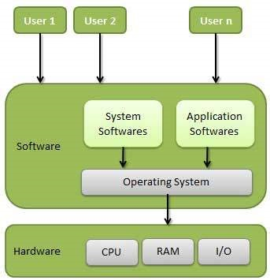
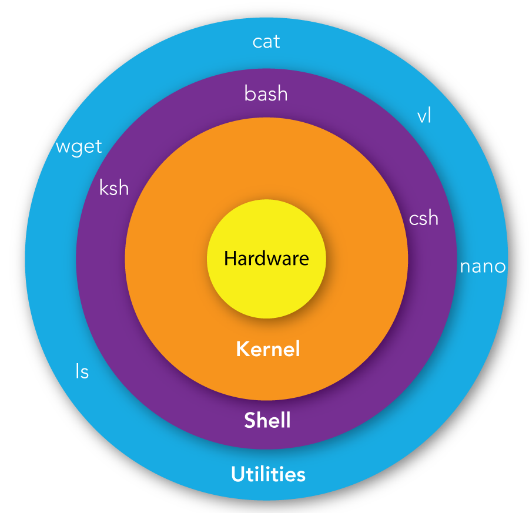

## Beskrivelse
Vi skal se på operativsystemets opgaver, herunder command shell og brug af git fra command prompten

## Forberedelse
### For windows brugere: ###
Opsætning af git bash terminal i IntelliJ: [Setting up git bash in IntelliJ](https://www.youtube.com/watch?v=3chFGUdKp9M)  

### Se disse videoer: ###
[Lecture 1: Course Overview + The Shell (2020)](https://www.youtube.com/watch?v=Z56Jmr9Z34Q)  
[Git Tutorial for Beginners: Command-Line Fundamentals](https://www.youtube.com/watch?v=HVsySz-h9r4)  

### Resourcer: ###
[Bash cheat sheet](https://github.com/RehanSaeed/Bash-Cheat-Sheet)  
[Git cheat sheet](https://education.github.com/git-cheat-sheet-education.pdf)

## Læringsmål
* Kune forklare operativsystemets overordnede funktion 
* Kunne anvende bash command shell 
* Kunne anvende git bash 

## Indhold
### Operativsystemer
 
Definition: Et operativsystem (OS) er et program (software), der administrerer computerens hardware og software ressourcer.

* Primære Funktioner:
  - Ressourcestyring: CPU, hukommelse, I/O enheder.
  - Filsystem: Organisering af data i filer og mapper.
* Brugergrænseflade: CLI (Command Line Interface) og GUI (Graphical User Interface).
* Eksempler på OS:
  - Desktop OS: Windows, macOS, Linux
  - Server OS: Ubuntu Server, CentOS, Windows Server
  - Mobile OS: Android, iOS
  - Embedded OS: Real-time OS'er til specifik hardware

### Filsystem: Organisering af data i filer og mapper

Et filsystem er den måde, et operativsystem organiserer og gemmer data på en harddisk eller anden lagringsenhed. Det giver en hierarkisk struktur af mapper (kataloger), hvor hver mappe kan indeholde filer og undermapper.

Filsystemet gør det muligt for brugeren og systemet at finde og håndtere filer logisk og effektivt.

#### Eksempel på katalogstruktur:
```plaintext
/home/
├── student/
│   └── projekter/
│       ├── bash-opgave/
│       │   ├── script.sh
│       │   └── output.txt
│       ├── java-projekt/
│       │   ├── Main.java
│       │   └── README.md
│       └── noter.txt
```

Forklaring:
- Mapper vises med `/` efter navnet.
- Filer vises uden skråstreg.
- `projekter/` indeholder to undermapper med tilhørende filer.
- `noter.txt` er en fil direkte i `projekter/`.

Hver mappe og fil kan tilgås via sin fulde sti, fx:  
`/home/student/projekter/java-projekt/Main.java`

Denne struktur gør det let at holde filer adskilt og organiseret efter projekter eller formål.

**Specielt for windows:**

C:\ bliver til: /c/  
D:\ bliver til: /d/  
osv.  

Bash bruger forward slash / som stiadskiller, i modsætning til backslash \ i klassisk Windows.  
Eksempel:  
```bash 
touch /c/Users/student/projekter/noter.txt
```  
Denne kommando opretter en fil direkte i mappen projekter på C-drevet.

## Shell ##
  
Definition: En shell er et kommandotolkningsprogram, der giver brugeren mulighed for at interagere med operativsystemet ved hjælp af kommandoer.  

* Typer af Shells:
  * Bash (Bourne Again Shell): Standard for mange Linux-distributioner.
  * Zsh (standard på mac, en extension af bash), Fish, Ksh: Alternative shells.
* Shell kommandoer udføres i et command line interface (CLI)
  * Vi bruger en standard shell (bash), som er ens på tværs af OS
  * Bash shell bliver installeret ifm. installation af git
#### Bash Shell ####
Bash shell installeres sammen med git og findes typisk her:  
```bash
C:\Program Files\Git\git-bash
```
Udover git kommandoer understøtter git-bash en lang række kommandore til interaktion med operativsystemets filsystem.  
Se oversigt og eksempler her: [30 Bash Commands Cheat Sheet](https://phoenixnap.com/kb/bash-commands)  
#### Nyttige Bash-genveje og tips ####
Efterhånden som du bliver mere fortrolig med at bruge Bash, vil du opdage mange tidssparende genveje og tips. Her er nogle:

* Brug pil op og pil ned til at navigere gennem din kommandohistorik og hurtigt køre tidligere kommandoer igen.
* Tryk på Tab for at autofuldføre filnavne og katalognavne, hvilket sparer tid og reducerer tastefejl.
* Brug | (pipe) til at sende output fra en kommando som input til en anden, hvilket giver dig mulighed for at opbygge kraftfulde kommandokæder.
* Brug & efter en kommando for at køre den i baggrunden, så du kan fortsætte med at bruge din terminal til andre opgaver.


