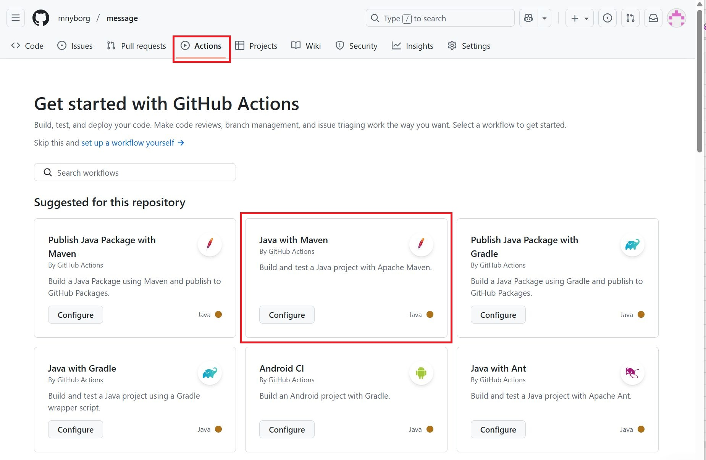

# Spring boot Github action workflow

Vi skal lave vores første Gitbuh workflow for et Spring boot projekt. Projektet er message eksemålet fra uge 35

## Gihub repository

- Opret et lokalt git repository 
- Opret et remote repository, message, på Github
- Push det lokale git repository til Github repositoriet 

## Template action workflow fil
Git hub actions tilbyder en række forskellige template filer til forskellige teknologier.  
Vi skal anvende "Java with Maven".  
- Gå til Actions tab og vælg "Java with Maven".

  

Template filen maven.yml vises nu:  
```yml
# This workflow will build a Java project with Maven, and cache/restore any dependencies to improve the workflow execution time
# For more information see: https://docs.github.com/en/actions/automating-builds-and-tests/building-and-testing-java-with-maven

# This workflow uses actions that are not certified by GitHub.
# They are provided by a third-party and are governed by
# separate terms of service, privacy policy, and support
# documentation.

name: Java CI with Maven

on:
  push:
    branches: [ "main" ]
  pull_request:
    branches: [ "main" ]

jobs:
  build:

    runs-on: ubuntu-latest

    steps:
    - uses: actions/checkout@v4
    - name: Set up JDK 17
      uses: actions/setup-java@v4
      with:
        java-version: '17'
        distribution: 'temurin'
        cache: maven
    - name: Build with Maven
      run: mvn -B package --file pom.xml

    # Optional: Uploads the full dependency graph to GitHub to improve the quality of Dependabot alerts this repository can receive
    - name: Update dependency graph
      uses: advanced-security/maven-dependency-submission-action@571e99aab1055c2e71a1e2309b9691de18d6b7d6
```
