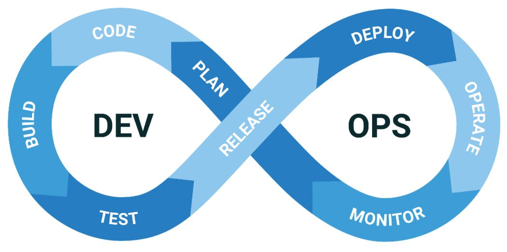
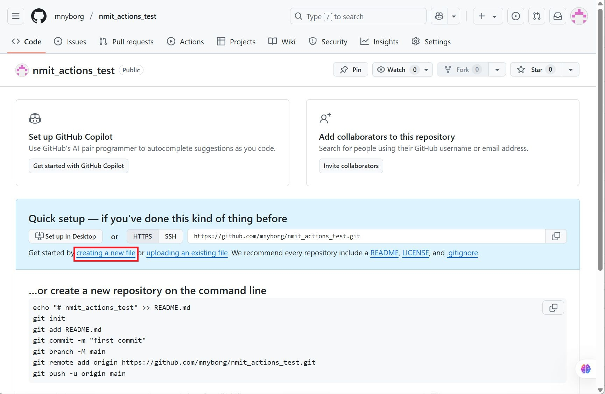
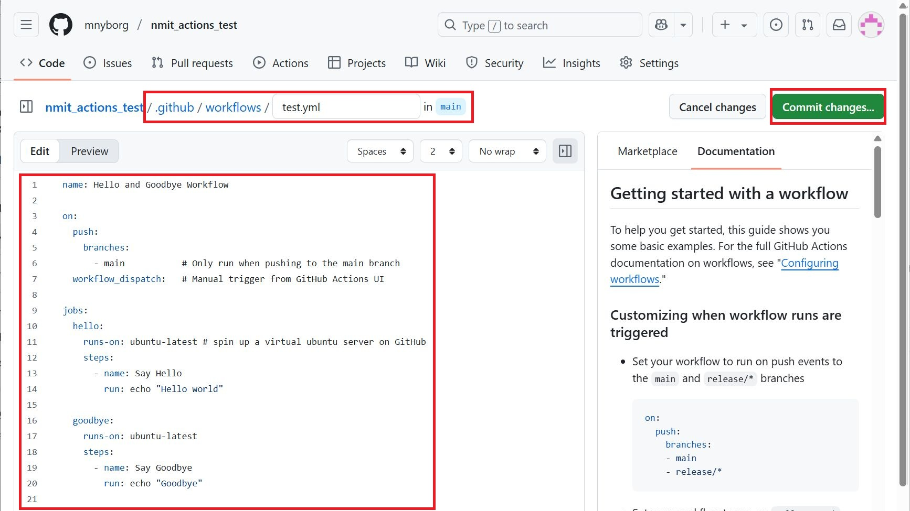
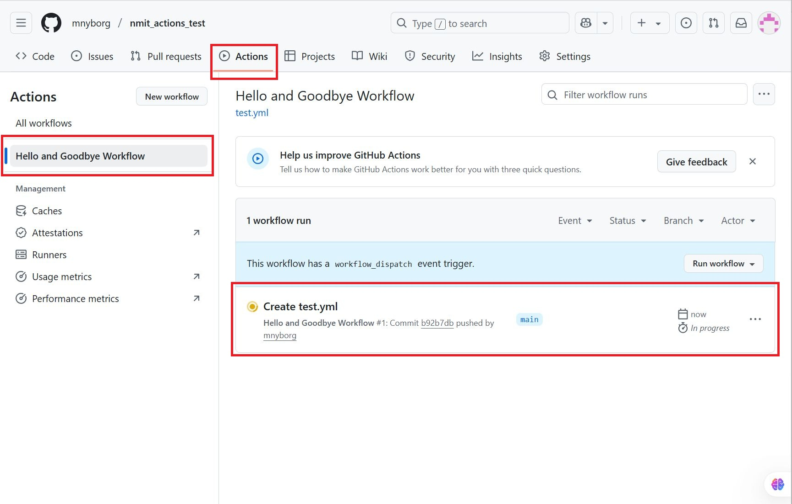
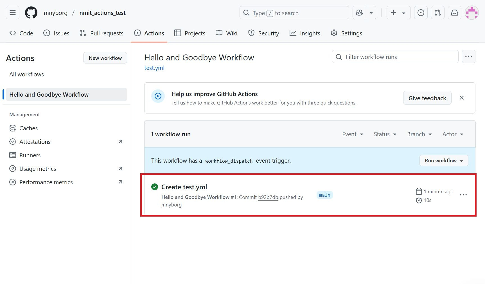
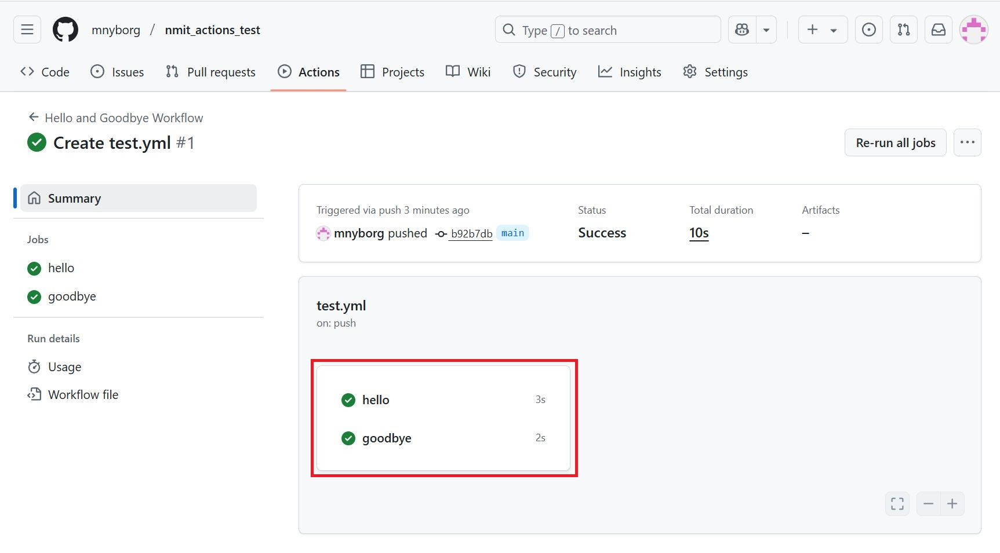
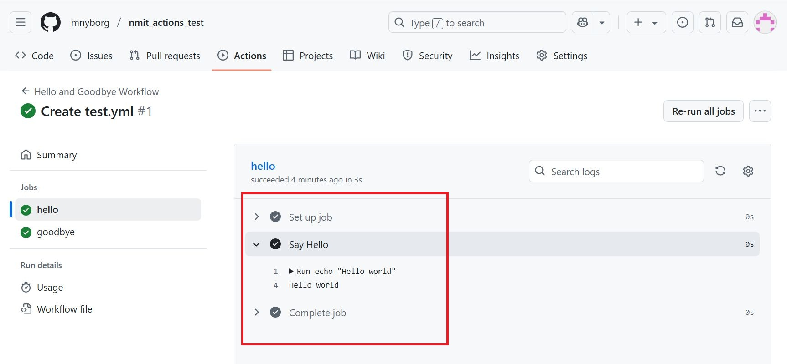

# GitHub Actions 1

## Beskrivelse
Vi ser på hvad DevOps er og kommer i gang med at automatisere vores software udviklingsproces ved at lave vores første GitHub Actions workflow

## Forberedelse
Se disse videoer (total : 40 min):  
[CI/CD Explained | How DevOps Use Pipelines for Automation](https://www.youtube.com/watch?v=M4CXOocovZ4)  
[GitHub Actions - Supercharge your GitHub Flow](https://www.youtube.com/watch?v=cP0I9w2coGU)  
[GitHub Actions - Create a Simple GitHub Workflow](https://www.youtube.com/watch?v=sZ_Z8l95g4s)    
[YAML | In One Video](https://www.youtube.com/watch?v=cdLNKUoMc6c)  

Resourcer:  
[Understanding GitHub Actions](https://docs.github.com/en/actions/get-started/understand-github-actions#jobs)


## Læringsmål
- At kunne forklare hvad DevOps er  
- At kunne forklare og anvende GitHub Flow
- At kunne etablere et CI workflow med GitHub Actions

## Indhold

### DevOps  
  
DevOps er en kulturel og organisatorisk tilgang, der fremmer samarbejde mellem udviklings- og driftsteams.  

CI/CD (continuous integration and continuous delivery) er et sæt af praksisser til automatisering af bygge-, test- og idriftsættelseprocessen.

### Dit første Github Actions workflow  

Vi skal lave vores første workflow i GitHub Actions. Ideen er at vi laver et workflov (test.yml), der består af to jobs:  
- et jeb der udskriver "Hello world" til konsollen
- et job der udskriver "Goodbye" til konsollen

**test.yml**  
```yml
name: Hello and Goodbye Workflow

on:
  push:
    branches:
      - main           # Only run when pushing to the main branch
  workflow_dispatch:   # Manual trigger from GitHub Actions UI

jobs:
  hello:
    runs-on: ubuntu-latest # spin up a virtual ubuntu server on GitHub
    steps:
      - name: Say Hello
        run: echo "Hello world"

  goodbye:
    runs-on: ubuntu-latest
    steps:
      - name: Say Goodbye
        run: echo "Goodbye"
```


**Opet et nyt repository (du bestemmer sevl hvad et skal hedde)**    
  

**Opret test.yml fil**  
test.yml skal ligge i sub-folderen: .github/workflows  
  

**wokflow run**  
Gå til "Actions" tab og observér at worflowet kører    
 

**wokflow complete**  
Observér at worflowet afslutter uden fejl (grøn)      
 

**wokflow result**  
Observér worflowet steps        


**wokflow detailed result**  
Observér worflowet steppet "Say Hello"        



## Aktiviteter
Gennemfør: [Hello GitHub Actions](https://github.com/skills/hello-github-actions)
